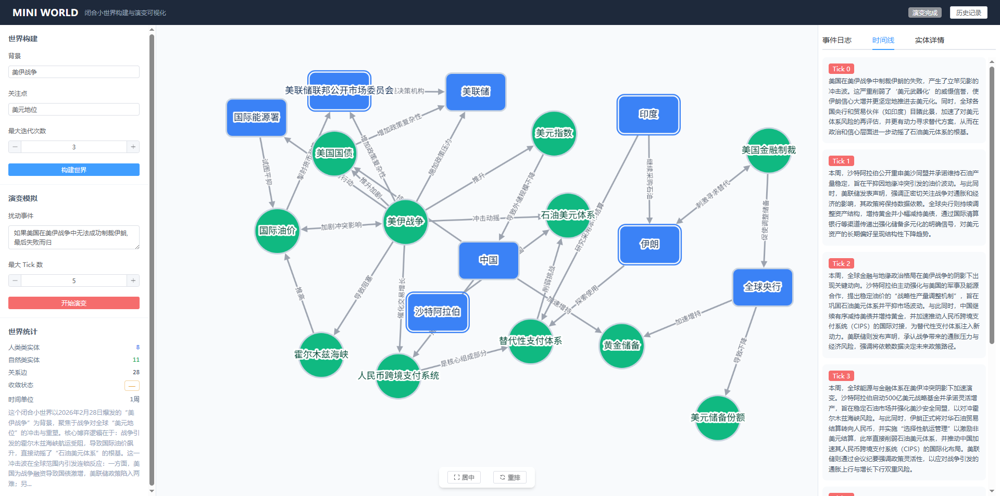

<div align="center">

# 🌍 MiniWorld-Evolution

**用真实情报构建闭合世界，让多个 AI Agent 自主博弈推演未来**

[](LICENSE)
[](https://python.org)
[](https://github.com/zn-ffmb/MiniWorld-Evolution)

输入一个真实事件背景 → 自动搜索构建实体关系图谱 → 注入一个扰动 → 各方 Agent 基于角色立场自主决策、逐轮博弈

[快速开始](#-快速开始) · [核心机制](#-核心机制) · [架构详解](#-架构详解) · [可视化平台](#-可视化平台) · [配置说明](#-配置说明)



</div>

---

## 🤔 为什么做这个项目？

大模型做"未来推演"有一个根本性问题——**幻觉**。

你问 LLM "如果伊朗封锁霍尔木兹海峡会发生什么"，它会编出一个听起来合理但完全脱离现实的推演。因为它把训练数据里的通识知识和自己凭空编造的"情报"混在了一起，你无法分辨。

**MiniWorld-Evolution 的核心约束：LLM 只能基于真实搜索到的证据推理，禁止创造情报。**

```
真实世界事件 ──→ [L1 搜索构建闭合世界] ──→ 实体关系图谱 ──→ [L2 注入扰动多Agent推演] ──→ 演变时间线
                   三级收敛验证保证质量        每条证据有来源URL    WorldLLM × Agent 逐Tick博弈
```

## ✨ 核心机制

### 🔒 闭合世界约束 — 不让 LLM 编故事

所有实体、关系、状态都必须有搜索来源 URL。`EvidenceValidator` 会拦截任何没有证据支撑的信息。LLM 在这个系统里只能"分析已知信息"，不能"创造新情报"。

### 🤖 Agent 自主决策 — 不是剧本杀，是真博弈

每个参与方（国家、组织、市场）都是一个独立的 LLM Agent，拥有自己的角色身份和能力边界。每轮决策时，Agent 自行判断要不要行动、怎么行动——WorldLLM 不干预，只传播结果。

### 🎭 角色差异化决策 — 同一世界，不同立场

所有 Agent 接收完全相同的世界状态信息和公开事件时间线。决策差异来自两个维度：每个 Agent 拥有独立的 **角色身份提示词（agent_prompt）**，定义了其立场、关注点和决策风格；以及独立的 **行动历史（action_history）**，记录了该 Agent 之前所有轮次的行动及其效果。同一份情报，军事力量关注的是威胁评估，经济组织关注的是市场冲击——角色认知差异驱动决策分化。

### 📐 三级收敛检测 — 世界质量有保证

不是跑固定轮次就停，而是三道关卡全过才算完成：
- **L1 结构完整性**：图论检测（连通图 + 无孤立节点）
- **L2 功能完整性**：角色覆盖率 + 关系密度
- **L3 语义完整性**：LLM 反思快照能否自洽解释背景

### ⚡ 能力边界 vs 具体动作 — Agent 不会重复杀死同一人

不给 Agent 一个动作菜单（"发动空袭"、"外交斡旋"），而是定义能力边界（"你有能力对军事目标发动精确打击"）。具体行动由 Agent 根据当前局势自主创造，避免重复执行已发生的事。

## 📸 演变示例

以 **"美伊战争 × 美元地位"** 为例，输入扰动："美国制裁失败，伊朗完全抵抗"

```
Tick 0  扰动注入 → 伊朗石油出口韧性增强，人民币结算获得背书，外国央行加速抛售美债
Tick 1  OPEC+ 启动增产 → 油价承压，美国页岩油面临挤压
Tick 2  外国央行集体减持美债 → 美债收益率飙升，美联储政策两难
Tick 3  海湾国家外交多元化 → 减少对美依赖，探索与中俄合作
Tick 4  美国国内政治压力爆发 → 反战抗议，支持率下跌
         ...
最活跃Agent: OPEC+  |  变化最多的实体: 美国国内政治压力
```

> 以上为真实运行结果，每一步推理都基于 L1 阶段搜索到的真实新闻和报告。

## 🚀 快速开始

### 1. 克隆 & 安装

```bash
git clone https://github.com/zn-ffmb/MiniWorld-Evolution.git
cd MiniWorld-Evolution
pip install -r requirements.txt
```

### 2. 配置 API Key

复制 `.env.example` 为 `.env` 并填写：

```env
# LLM API（必填，支持任何 OpenAI 兼容接口：Qwen / GPT-4o / Claude 等）
WORLD_ENGINE_API_KEY=your_api_key
EVOLUTION_ENGINE_API_KEY=your_api_key

# 搜索 API（至少填一个）
TAVILY_API_KEY=your_tavily_key      # 国际新闻搜索
BOCHA_API_KEY=your_bocha_key        # 国内可用的多模态搜索
```

### 3. 构建闭合小世界（L1）

```bash
python run_build_world.py --background "美伊战争" --focus "石油价格与美元地位"
```

系统自动搜索新闻报告 → 提取实体关系 → 三级收敛验证 → 输出世界快照到 `worlds/`

### 4. 运行演变推演（L2）

```bash
python run_evolution.py \
  --world worlds/world_20260414_155041.json \
  --perturbation "伊朗宣布完全封锁霍尔木兹海峡" \
  --max-ticks 10
```

各方 Agent 自主决策 → 状态逐轮传播 → 输出演变时间线到 `evolutions/`

### 5. 可视化平台（可选）

```bash
# 后端
cd visualization/backend
uvicorn main:app --reload --port 8000

# 前端
cd visualization/frontend
npm install && npm run dev
```

访问 `http://localhost:5173`，实时观看实体关系图谱构建过程和逐 Tick 演变动画。

## 🏗 架构详解

### L1 WorldEngine — 闭合小世界构建

八阶段迭代管线，迭代搜索直到三级收敛检测通过：

```
输入: 背景 + 关注点
        │
Phase 1  SearchPlanNode       → 假设驱动的三维度搜索规划（影响因素/关键实体/核心问题）
Phase 2  SearchExecutionNode  → 并行搜索 (Tavily/Bocha)，按维度聚类采样去噪
Phase 3  EntityExtractionNode → 实体 & 关系提取 + EvidenceValidator 证据溯源校验
Phase 4  WorldMergeNode       → 实体图谱增量融合（去重 & 合并）
Phase 5  ConvergenceCheckNode → 三级收敛检测（结构 → 功能 → 语义）
              ↓ 收敛后执行 ↓
Phase 6  PromptGenerationNode → human 类实体生成 agent_prompt + action_space（能力边界）
Phase 7  WorldMetaNode        → 世界元信息（标题/描述/tick_unit）
Phase 8  SnapshotExportNode   → 导出 WorldSnapshot（JSON + Markdown 报告）
```

### L2 EvolutionEngine — 闭合小世界演变

WorldLLM（世界规则引擎）× AgentRunner（Agent 决策执行器）逐 Tick 协作：

```
输入: WorldSnapshot + 扰动事件
        │
Tick 0   WorldLLM.inject_perturbation → 注入扰动，产生即时冲击
        │
        ▼  ── 循环 max_ticks 次 ──────────────────────────────
Step 1   WorldLLM.assess    → 评估局势（核心矛盾 & 关键张力）
Step 2   WorldLLM.plan      → 准备统一世界状态快照（不调用 LLM）
Step 3   AgentRunner × N    → 所有 human Agent 并发自主决策
                               输入: 统一世界状态 + 公开事件时间线 + 个人行动历史
                               输出: do / decide / say / wait
Step 4   WorldLLM.propagate → 行动传播为实体状态 & 关系更新
Step 5   WorldLLM.narrate   → 叙事摘要 & 终止检测
        ▼  ─────────────────────────────────────────────────
TimelineExporter → 导出完整演变时间线（JSON + Markdown）
```

### 实体双态模型

| 类型 | 示例 | L2 行为 |
|------|------|---------|
| `human` | 国家、组织、政治人物 | AgentRunner 驱动，独立 LLM 自主决策 |
| `nature` | 油价、汇率、舆论指数 | WorldLLM 直接更新，无自主意志 |

## 🖥 可视化平台

前端 Vue 3 + Cytoscape.js，后端 FastAPI + SSE 实时流式推送。

- **构建阶段**：实体和关系边逐条"生长"出来，实时观看图谱膨胀
- **演变阶段**：每个 Tick 叙事滚动出现，受影响实体高亮闪烁
- **零侵入设计**：可视化层完全通过 import 复用引擎代码，不修改任何已有文件

## 📁 项目结构

```
├── WorldEngine/              # L1 闭合小世界构建引擎
│   ├── builder.py           # 构建调度中心
│   ├── nodes/               # 8个管线节点
│   ├── search/              # 搜索协调 + API 客户端（Tavily / Bocha）
│   ├── state/               # 世界状态模型（Entity, Edge, WorldSnapshot）
│   ├── llms/                # LLM 客户端抽象
│   └── prompts/             # L1 Prompt 模板
│
├── EvolutionEngine/          # L2 闭合小世界演变引擎
│   ├── engine.py            # 演变调度中心
│   ├── world_llm.py         # WorldLLM 世界规则引擎
│   ├── agent_runner.py      # Agent 决策执行器
│   ├── exporters/           # 时间线导出
│   └── prompts/             # L2 Prompt 模板
│
├── visualization/            # Web 可视化平台
│   ├── backend/             # FastAPI + SSE
│   └── frontend/            # Vue 3 + Cytoscape.js
│
├── worlds/                   # L1 输出（世界快照）
├── evolutions/               # L2 输出（演变时间线）
├── config.py                 # 全局配置（pydantic-settings）
├── run_build_world.py        # L1 命令行入口
└── run_evolution.py          # L2 命令行入口
```

## ⚙️ 配置说明

所有配置通过 `.env` 文件管理，详见 `config.py`：

| 参数 | 默认值 | 说明 |
|------|--------|------|
| `WORLD_ENGINE_MODEL` | `qwen-plus` | L1 构建用 LLM 模型 |
| `EVOLUTION_ENGINE_MODEL` | `qwen-plus` | L2 演变用 LLM 模型 |
| `MAX_BUILD_ITERATIONS` | `3` | L1 最大迭代次数 |
| `EVOLUTION_MAX_TICKS` | `10` | L2 最大演变轮次 |
| `EVOLUTION_AGENT_TEMPERATURE` | `0.7` | Agent 决策温度（越高越"大胆"） |
| `SEARCH_CONCURRENCY` | `5` | 搜索并行线程数 |

支持任何 OpenAI 兼容 API（通义千问、GPT-4o、Claude、DeepSeek 等），国内可直接使用无需翻墙。

## 🎯 适用场景

- **地缘政治推演**：制裁、战争、外交博弈的多方连锁反应
- **经济冲击分析**：供应链中断、能源危机传导到金融市场的路径
- **历史反事实推演**："如果 X 没有发生，世界会怎样？"
- **多方利益博弈**：任何涉及多个有独立利益的参与方的复杂场景

## 🙏 致谢

搜索工具层（`WorldEngine/search/vendors/`）基于 [BettaFish](https://github.com/666ghj/BettaFish) 项目的搜索客户端与重试机制改写。感谢 BettaFish 团队的优秀开源工作。

## Star History

[](https://star-history.com/#zn-ffmb/MiniWorld-Evolution&Date)

## License

[GPL-2.0](LICENSE)
